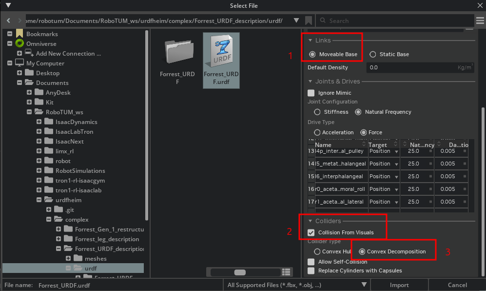

# IsaacNext

Short description of what this project does and who it’s for.

---
## How to obtain Forrest's URDF
You can find the Forrest's URDF file from this link:\
https://github.com/The-RoboTUM/urdfheim/tree/main/complex/Forrest_URDF_description/urdf 

You `git clone` the whole repo and go the above folder and find the urdf file.

In Isaacsim, we need to USD file, so we need to convert URDF file to USD file.

Nest, let's go through the operation steps in detail:

## How to prepare Forrest's USD


- Open Isaacsim
- Import the URDF file (change these settings)

  - Choose `Moveable Base`
  - Create `Collisions From Visuals`
  - Choose `Convex Decomposition`
- after you finish doing above steps, Isaacsim will generate a folder: `Forrest_URDF`, at the same place of the urdf file.
- Move only the generated folder `Forrest_URDF` over to the symlinks (In the future a script will do this)
- In Isaacsim, open `/IsaacNext/symlinks/Forrest_URDF/Forrest_URDF.usd`
- After you open the USD file, then on the right-hand Stage panel in IsaacSim, find the joints folder:

  - For all set stiffness to 100 and damping to 1
  - For anchor joints disable them from articulation
  - For anchor joints set max force to 1000, stiffness to 1000 and damping to 10
  - For passive pantograph joints (r3b, r4f, r4b, l3b, l4f, l4b) set the stiffness to 0
  - Set the offsets of all the joints to the list bellow (the **Joints limits** part)
- Use stage search for 'collisions' and for all disable instantiable flag
- Use stage search for 'mesh', for the active items, look all the bodies of the pantograph and the inner gears of the hip and disable collisions for them
- Testing set a ground and simulate, check collisions
- Go to joints and verify that all joints can be actuated

### Joints limits
- `l0_acetabulofemoral_roll` = [-180, 180]
- `l1_acetabulofemoral_lateral` = [-10, 10]
- `l2_pseudo_acetabulofemoral_flexion` = [-120, 120]
- `l3b_femorotibial_back` = [-180, 180]
- `l4b_intertarsal_back` = [-180, 35]
- `l3f_femorotibial_front` = [-76, 18]
- `l4f_intertarsal_front` = [-180, 180]
- `Virtual_S23_Assyv18_mirror_1_anchor` = [-0.0573, 0.0573]
- `l5_metatarsophalangeal` = [-20, 40]
- `l6_interphalangeal` = [-100, 90]
- `l4p_intertarsal_pulley` = [-180, 180]
- `l2p_acetabulofemoral_pulley` = [-180, 180]
- `l2b_acetabulofemoral_flexion` = [-180, 180]
- `l2f_acetabulofemoral_flexion` = [-180, 180]
- `r0_acetabulofemoral_roll` = [-180, 180]
- `r1_acetabulofemoral_lateral` = [-10, 10]
- `r2_pseudo_acetabulofemoral_flexion` = [-120, 120]
- `r3b_femorotibial_back` = [-180, 180]
- `r4b_intertarsal_back` = [-180, 180]
- `r3f_femorotibial_front` = [-76, 18]
- `r4f_intertarsal_front` = [-180, 180]
- `r4p_intertarsal_pulley` = [-180, 180]
- `Virtual_S23_Assyv18_1_anchor` = [-0.0573, 0.0573]
- `r5_metatarsophalangeal` = [-20, 40]
- `r6_interphalangeal` = [-100, 90]
- `r2p_acetabulofemoral_pulley` = [-180, 180]
- `r2b_acetabulofemoral_flexion` = [-180, 180]
- `r2f_acetabulofemoral_flexion` = [-180, 180]

---

## Collision Parameter Settings

After you have set the stiffness and motion range for each joint of the Forrest's USD file, the next step is to configure whether collisions are enabled for each joint. This ensures that the USD model more closely resembles the real physical world.

First, go to the Stage panel on the right side, locate the corresponding link, and click the ➕, Then, find `Collision`, open it, and locate the corresponding item. Click the ➕, then select `mesh`. In the Property panel below, go to `Extra Properties`, find `Collision Enabled`, and following the instructions below, choose whether to activate or deactivate it.

There is an example that illustrates the operation steps more vividly:
- `base_link`:
  - `Collision`
    - `Base_Assy_V2v18_1`
      - `mesh`: Collision Enabled ✅️
        


- `Differential_Cage_Assyv7_mirror_1`: 
  - `Collision`
    - `Differential_Cage_Assyv7_mirror_1`
      - `mesh`: Collision Enabled ✅️
    - `Pulley_Linkage_10mm_Bearingv1_mirror_10`: 
      - `mesh`: Collision Disabled ❌️
    - `Pulley_Linkage_10mm_Bearingv1_mirror_3`: 
      - `mesh`: Collision Disabled ❌️

- `Differential_Cube_Assy_V2v4_mirror_1`:
  - `Collision`
    - `Differential_Cube_Assy_V2v4_mirror_1`
      - `mesh`: Collision Disabled ❌️
    - `Outside_Hip_V2_Assyv28_mirror_1`
      - `mesh`: Collision Disabled ❌️

- `Knee_Assyv9_mirror_1`: 
  - `Collision`
    - `Knee_Assyv9_mirror_1`
      - `mesh`: Collision Enabled ✅️

- `S12p_Pantograph_Spring_Assy_Topv2_mirror_1`: 
  - `Collision`
    - `S12p_Pantograph_Spring_Assy_Topv2_mirror_1`
      - `mesh`: Collision Disabled ❌️
    - `S12p_Pantograph_Spring_Assy_Botv1_mirror_1`
      - `mesh`: Collision Disabled ❌️

- `S23_Assyv18_mirror_1_virtual`: 
  - `Collision`
    - `S23_Assyv18_mirror_1`
      - `mesh`: Collision Disabled ❌️ 

- `S12_Front_Assyv6_mirror_1`: 
  - `Collision`
    - `S12_Front_Assyv6_mirror_1`
      - `mesh`: Collision Disabled ❌️

- `S23_Assyv18_mirror_1`: 
  - `Collision`
    - `S23_Assyv18_mirror_1`
      - `mesh`: Collision Enabled ✅️

- `S34_Foot_Connector_Assy_mirror_1`: 
  - `Collision`
    - `S34_Foot_Connector_Assy_mirror_1`
      - `mesh`: Collision Enabled ✅️

- `S45_Digit_Assyv2_mirror_1`: 
  - `Collision`
    - `S45_Digit_Assyv2_mirror_1`
      - `mesh`: Collision Enabled ✅️
- `Main_GST_Pully_Assyv4_mirror_1`: 
  - `Collision`
    - `Main_GST_Pully_Assyv4_mirror_1`
      - `mesh`: Collision Disabled ❌️
- `Inner_Gear_Assy_V2v13_mirror_1`: 
  - `Collision`
    - `Inner_Gear_Assy_V2v13_mirror_1`
      - `mesh`: Collision Disabled ❌️
- `Cable_Gear_Motor_V2v8_mirror_1`: 
  - `Collision`
    - `Cable_Gear_Motor_V2v8_mirror_1`
      - `mesh`: Collision Disabled ❌️
- `Cable_Gear_Motor_V2v8_mirror_2`: 
  - `Collision`
    - `Cable_Gear_Motor_V2v8_mirror_2`
      - `mesh`: Collision Disabled ❌️


Now, the collision parameters for one leg are set. THe other leg, being fully symmetrical, uses the identical settings.


<!-- 
More to come ... 


The following instructions are still a work in progress.


## 📦 Installation

```bash
# Clone the repository
git clone git@github.com:your-org/your-repo.git

# Enter the project directory
cd your-repo

# Install dependencies (example for Python)
pip install -r requirements.txt

```
-->

## Train Forrest:
In Isaac Lab, you can use the following command to start reinforcement learning training for the robot in a selected environment:
```bash
 ./isaaclab.sh \
  -p scripts/reinforcement_learning/rsl_rl/train.py \
  --task=Isaac-Velocity-Rough-Forrest-v0 \
  --headless \
  --max_iterations=10000 \
  --num_envs=4096 \
  --resume
```
### Argument Explanation:
- `./isaaclab.sh`
Launches the Isaac Lab wrapper script, which runs the specified Python program and automatically loads the Isaac Lab environment configuration.

- `-p scripts/reinforcement_learning/rsl_rl/train.py`
Specifies the Python script to execute.
Here we use the training entry script for RSL-RL, a reinforcement learning framework based on PyTorch.

- `--task=Isaac-Velocity-Rough-Forrest-v0`
Selects the training task environment.

  - `Rough`: a scenario with complex uneven terrain.

  - `Forrest`: the name of our robot.

  - `-v0`: indicates the version number of this environment. 
  - Alternatively, you can choose the `Flat` scenario (flat terrain), which is useful for training in obstacle-free environments.

- `--headless`
Runs in headless mode (no rendering). This is recommended when training on servers or with large-scale parallel environments to save GPU/CPU memory and computation resources.

- `--max_iterations=10000`
Sets the maximum number of training iterations, here 10,000 iterations.
In each iteration, data is collected from multiple environments and used to update the policy.

- `--num_envs=4096` Specifies the number of parallel environments, here 4096 environments (or robots) running simultaneously. 
  - The more environments, the faster the data sampling, but the higher the demand on GPU/CPU resources. 
  - With our cerrent setup (RTX 5080 GPU AND 64 GB of RAM), 4096 environments is the upper limit. Therefore, please choose an appropriate numer of environments when running training.
  - These 4096 robots are independent. If you enable rendering, you may sometimes see them visually overlapping, but their trajectories and training batches remain unaffected.

- `--resume`
Continues training from a previously saved checkpoint instead of starting from scratch.


## Play Forrest:
```bash
./isaaclab.sh \
 -p scripts/reinforcement_learning/rsl_rl/play.py \
 --task=Isaac-Velocity-Flat-Forrest-Play-v0 \
 --num_envs=10
```

### Argument Explanation:
- `./isaaclab.sh`
Launches the Isaac Lab wrapper script, which runs the specified Python program and automatically loads the Isaac Lab environment configuration.

- `-p scripts/reinforcement_learning/rsl_rl/play.py`
Specifies the Python script to execute. Here we use play.py, which is designed to load a trained policy and run it for testing (letting the robot “play” with what it has learned).

- `--task=Isaac-Velocity-Flat-Forrest-Play-v0`
Selects the task environment to run.

  - `Flat`: a flat terrain scenario without obstacles, making it easier to observe the learned behavior.

  - `Forrest`: the name of our robot.

  - `Play`: indicates this is a test/demo environment for running an already trained policy rather than training from scratch.

  - `-v0`: the version number of this environment.

- `--num_envs=10`
Specifies the number of parallel environments, here 10 robots running simultaneously.
This smaller number is convenient for testing and visualization, allowing you to observe the performance of multiple robots at once.

More to come ... 